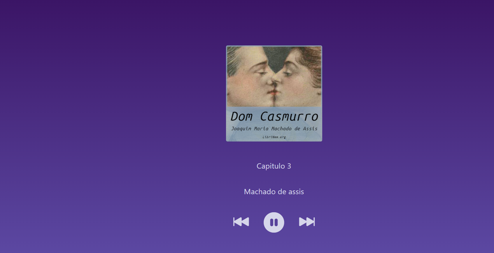

# 
Audiobook

### O que é?

Este é um projeto feito como auxílio do Intensivão da Hashtag. Um aplicativo de audiobooks, onde é possível navegar dentre 10 faixas do livro "Dom Casmurro". Dentro deste aplicativo o usuário pode:
<ul>
<li>Avançar or retroceder pra qual capítulo desejar</li>
<li>Iniciar e pausar quando desejar</li>
<li>Acessar o link do site de audiobooks, clicando na imagem principal</li>
</ul>

### Tecnologias usadas:

### Como utilizar:
Para utilizar checar a página, basta clicar no [link de acesso](https://intensivao-js-hashtag-audiobook.vercel.app) ou clonar todo este repositório com `git clone https://github.com/IgorVianadF/intensivaoJSHashtag.git` e executar o index.html do 'HashLivros-I'

### Imagem:

