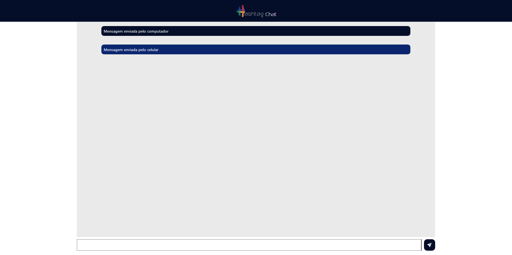

# 
Hashchat

### O que é?

Este é um projeto feito como auxílio do Intensivão da Hashtag. Um aplicativo de chat em tempo real, com a utilização de tecnologia websocket. Conecte na sua LAN e mande mensagens localmente.

### Tecnologias usadas:

### Como utilizar:

#### Rodando:
Para utilizar essa página, basta clonar este repositório utilizando `git clone https://github.com/IgorVianadF/intensivaoJSHashtag.git`, entre no diretorio usando `cd hashchat-iv`. Abra a página 'Hashchat-IV', em server.js você vai trocar os números '999.999.999.999' pelo seu IpV4 , se não souber como, use [esse artigo da microsoft](https://support.microsoft.com/pt-br/windows/encontre-seu-endereço-ip-no-windows-f21a9bbc-c582-55cd-35e0-73431160a1b9). Após colocar seu IpV4, utilize o comando `npm start` no terminal da pasta. No seu browser, você vai pesquisar o seu Ipv4 com a porta 8080, por exemplo: "999.999.999.999:8080".

Desde que todos os seus dispositivos estejam na mesma rede local, eles poderão enviar e receber mensagens dentro do chat(celulares, computadores, notebooks, tablets).

### Imagem:

