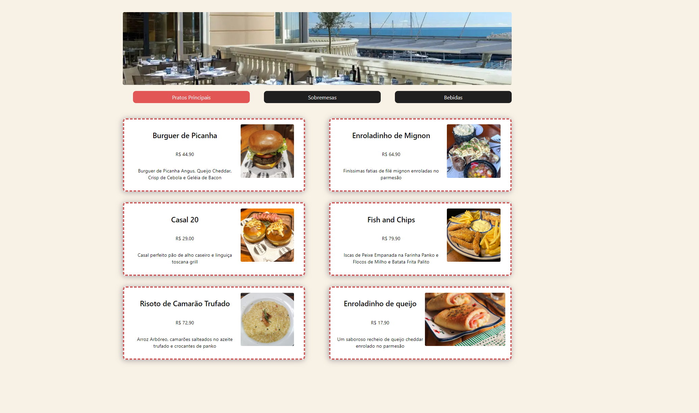

# 
Hashtaurante

### O que é?

Este é um projeto feito como auxílio do Intensivão da Hashtag. Um site de cardápio de restaurante, feito em react, onde você pode navegar pelas categorias dinamicamente e adicionar novos pratos.

### Tecnologias usadas:

### Como utilizar:

#### Rodando:
Para checar a página, basta clicar no [link de acesso](https://intensivao-js-hashtag-hashtaurante.vercel.app) ou clonar todo este repositório com `git clone https://github.com/IgorVianadF/intensivaoJSHashtag.git` abrir a pasta 'Hashtaurante-III', entrar no diretório utilzando `cd hashtaurante-iii`, no terminal, digitar `npm start` e utilizar a url disponibilizada.

#### Adicionando novo item:
Para adicionar um novo item ao cardápio, basta modificar o arquivo cardapio.js, no caminho `./src/cardapio.js`. Você irá:

<li>Criar um novo objeto com nome, preço, imagem e descrição </li>
<li>Adicionar a imagem na pasta './assets/(bebidas, pratos ou sobremesas)'</li>
<li>Importar a imagem no campo imagem do objeto cardapio.js usando a URL</li>
<li>Adicionar o objeto no array a qual ele pertence</li>

### Imagem:

