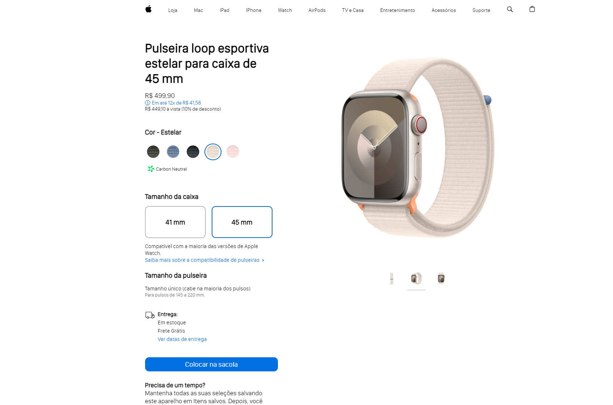

# Intensivão de JS da Hashtag Programação

<h2>Em andamento</h2>

### Objetivo

O intensivo teve o objetivo de ensinar quem estivesse começando, e auxiliar a quem já estivesse na área, porém precisando de um destaque ou alavancar seu repertório de projetos.

### Projetos

Durante os quatro dias de aula, temos 4 projetos totalmente diferente um do outro para expandir sua área de conhecimento.

<li>Audiobook</li> :ballot_box_with_check:

 
 
<li>Pagina apple watch</li> :ballot_box_with_check:

 
 
<li>Cardápio digital</li> :ballot_box_with_check:

 
 
<li>Chat em tempo real</li> :ballot_box_with_check:

 

### Tecnologias e conteudo

Durante as aulas, vemos tecnologias muito usadas no front-end como HTML, CSS, Javascript, React, Node. Usamos express e vite para deploy de servidores. Em geral foi uma experiência enriquecedora em todos os aspectos, como utilizar o JS para controlar a DOM, utilizar o react e seus componentes para construir um site de forma mais eficiente, como usar jsx, etc.
